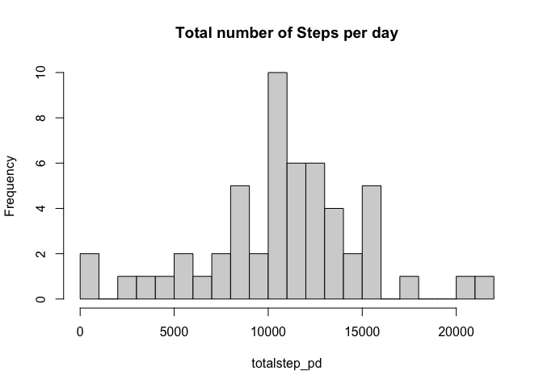
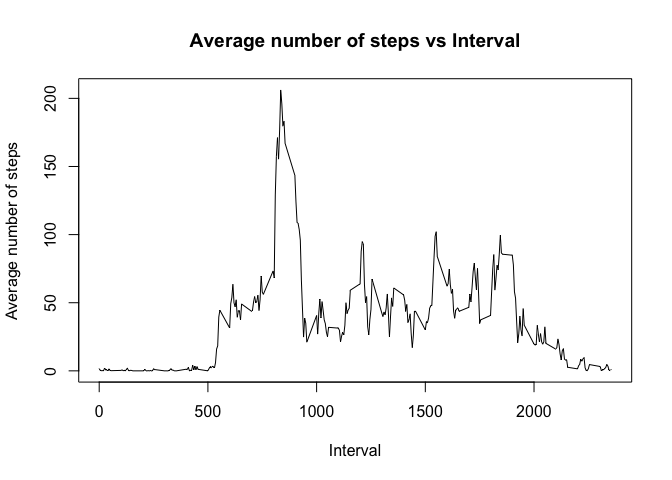
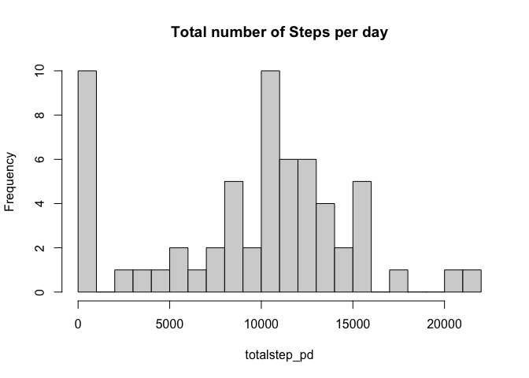
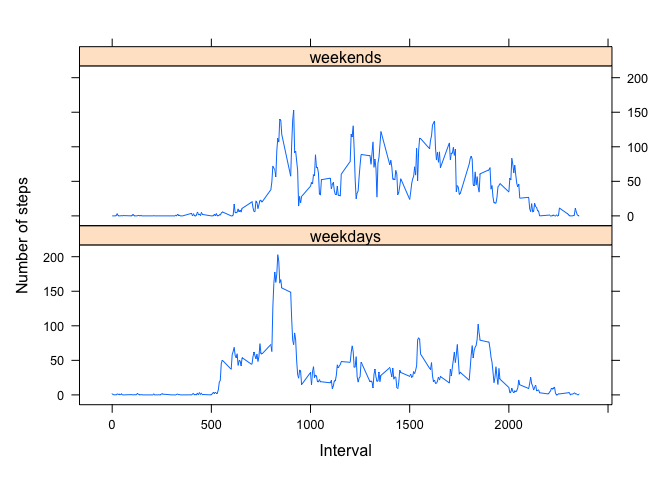

## Loading and preprocessing the data

### Loading and preprocessing the date
The data is compressed in a zip file to load data into a datatable first I unzip the file and read the unzipped csv file in a datatable data. 


```r
# loading the data
data<-read.csv(unz('activity.zip','activity.csv'),header=T)

# display first five values.
head(data,5)
```

```
##   steps       date interval
## 1    NA 2012-10-01        0
## 2    NA 2012-10-01        5
## 3    NA 2012-10-01       10
## 4    NA 2012-10-01       15
## 5    NA 2012-10-01       20
```

```r
# displaying last five values.
tail(data,5)
```

```
##       steps       date interval
## 17564    NA 2012-11-30     2335
## 17565    NA 2012-11-30     2340
## 17566    NA 2012-11-30     2345
## 17567    NA 2012-11-30     2350
## 17568    NA 2012-11-30     2355
```


## What is mean total number of steps taken per day?
To start with we omit all the data that has NA.

#### Histogram of total number of steps taken each day
To get a number of total steps taken per day we split the data frame according to date and sum all the step taken in one day. Once this step is done we have total number of steps for each day. We can plot histogram for this and we will get a distribution of total number of steps taken every day. Someday we have more steps and some day we have less.


```r
# subsetting dataset without any NA
datana_ignore<-data[!is.na(data),]

# splitting data according to date
steps_pd<-split(datana_ignore$steps,as.Date(datana_ignore$date))

# total step per day summing the data for each date.
totalstep_pd<-sapply(steps_pd, sum)

# histogram of steps for each day
hist(totalstep_pd,breaks=20,main='Total number of Steps per day')
```

<!-- -->

```r
# rounding off the result to two decimal places
meanstep<-round(mean(totalstep_pd),2)
print(c("meanstep:",meanstep))
```

```
## [1] "meanstep:" "10766.19"
```

```r
# median steps 
medianstep<-median(totalstep_pd)
print(c("mediansteps:",medianstep))
```

```
## [1] "mediansteps:" "10765"
```
#### Mean and Median of total number of steps taken everyday.
Using this we can calculate the mean and median of total number of steps taken in a day. The mean number of steps taken in a day is  1.0766\times 10^{4}. The median of the distribution of steps taken in a day is 10765.


## What is the average daily activity pattern?

#### Time series plot of 5-minute interval
To guess the average daily activity pattern we plot steps averaged over all the days for the entire duration for each 5 mins interval.

```r
# splitting data according to interval
split_data<-split(data$steps,data$interval)

# plotting mean number of steps for each interval averaged over all the dates
plot(x=names(split_data),y=sapply(split_data,mean,na.rm=TRUE),type="l",xlab='Interval',ylab='Average number of steps',main='Average number of steps vs Interval')
```

<!-- -->

```r
# maximum number of steps
max_activity<-which.max(sapply(split_data,mean,na.rm=TRUE))
max_activity
```

```
## 835 
## 104
```

#### Maximum activity interval
We can see initially the value is zero since it is mid night and people are not active during night time. We can use which.max function to find out the period at which activity is really high. The activity is really high at 104th interval. This interval corresponds to morning around 8:35 AM.


## Imputing missing values

#### Number of missing values

```r
# finding number of rows with missing data
n_missing<-sum(is.na(data))
n_missing
```

```
## [1] 2304
```

The total number of rows with NA is 2304.

#### Strategy for imputation


```r
# finding the total dates with missing values
na_data<-data[is.na(data$steps),]
date_tb<-table(na_data$date)
print(date_tb)
```

```
## 
## 2012-10-01 2012-10-08 2012-11-01 2012-11-04 2012-11-09 2012-11-10 2012-11-14 
##        288        288        288        288        288        288        288 
## 2012-11-30 
##        288
```
A careful analysis also shows that there are few days with missing data for the entire day and we need to devise a strategy to impute those values. Using mean/median number of steps of the particular day that has missing value to impute will in this case lead to substitution of zero. Since there is no data for the entire day. We impute with the mean number of steps for the day in this case this will impute all the NAs with 0.   

#### Imputed dataset
The new data set is created by copying the old dataset getting the date that has missing value and the average number of steps for that day. To replace value we find the location of NA for each date and replace it with the mean corresponding to that day.

```r
# copying data
copy_data<-data 

# splitting data for each date
split_data<-split(copy_data,copy_data$date)
imp_val=list()
for(j in names(split_data)){
      # cheking if there is a missing value for this particular date
      if(sum(is.na(split_data[[j]]$steps))!=0){
        
          temp_val<-mean(split_data[[j]]$steps,rm.na=TRUE)
          
          # values that will be imputed if there are only NAs in the array of missing value for a date
          imp_val[j]<-ifelse(is.na(temp_val),0,temp_val)}
              
    }

  
    for (j in names(imp_val)){
        yi<-rownames(copy_data[copy_data$date==j,])
        # imputing the value in the dataframe for each instance of NA      
        for (i in yi){ copy_data[i,]$steps<-imp_val[[j]]}
    }
```
#### Histogram of the total number of steps taken each day,
The histogram for the imputed dataset shows a lot of values near 0. This is expected since we ignored NA in the previous histogram but now those NAs are replace by 0.


```r
# splitting data for each date
steps_pd<-split(copy_data$steps,as.Date(copy_data$date))

# total step per day.
totalstep_pd<-sapply(steps_pd, sum)

hist(totalstep_pd,breaks=20,main='Total number of Steps per day')
```

<!-- -->

```r
# rounding off the result to two decimal places
meanstep<-round(mean(totalstep_pd),2)
print(c("meanstep:",meanstep))
```

```
## [1] "meanstep:" "9354.23"
```

```r
# median step after imputation
medianstep<-median(totalstep_pd)
print(c("mediansteps:",medianstep))
```

```
## [1] "mediansteps:" "10395"
```
The mean of the imputed dataset is 9354.23. The median is 1.0395\times 10^{4}. These values are lower than what we got in the previous analysis. This is kind of expected since we are increasing the number of observations by including 0. However, they don't add any number to the total steps thus our mean and median decreases. One more observation we can see that the mean gets more affected by adding imputed values compared to median.


## Are there differences in activity patterns between weekdays and weekends?


#### Creating new variable in the dataset
The new factor variable can be created by using weedays() function. It returns a day given a date and if this day is a weekday the value of factor variable is weekday else it it's weekend. This calculating is performed on the imputed dataset (copy data).

```r
library(tidyverse)

# copying the data to new dataframe
dataweeks<-copy_data

# extracting day from the date
dataweeks$weekdays<-weekdays(as.Date(dataweeks$date))

# summary of all the days
table(dataweeks$weekdays)
```

```
## 
##    Friday    Monday  Saturday    Sunday  Thursday   Tuesday Wednesday 
##      2592      2592      2304      2304      2592      2592      2592
```

```r
# list of days in the weekend
weekend<-c("Saturday","Sunday")

# check if the day is in weekend or not. If yes set the typeday factor of dataweeks to weekend otherwise set it to weekday.
dataweeks$typeday<-factor(ifelse(dataweeks$"weekday"%in%weekend,"weekends","weekdays"))

# checking the total number of days in the category
table(dataweeks$typeday)
```

```
## 
## weekdays weekends 
##    12960     4608
```

```r
# calculating mean according to interval for weekday and weekend
splitdata<-sapply(split(dataweeks$steps,list(dataweeks$interval,dataweeks$typeday)),mean)


dft<-data.frame()

for(j in names(splitdata)){
  si<-strsplit(j,".",2)[[1]]
   dft<-rbind(dft,c(si[[1]],si[[2]],splitdata[[j]]))
}

# naming columns of the dataframe
names(dft)<-c("interval","typeday","steps")

dft[,c(1,3)]<-sapply(dft[,c(1,3)],as.numeric)
```

#### Plotting activity for weekday and weekend.
The distribution of steps on weekdays and weekends is quite different during the week. This can be plotted by using average steps for each interval and plotting it separately for weekdays and for weekends.

```r
library(lattice)

xyplot(steps~interval|typeday,dft,type="l",layout=c(1,2),xlab='Interval',ylab='Number of steps')
```

<!-- -->


